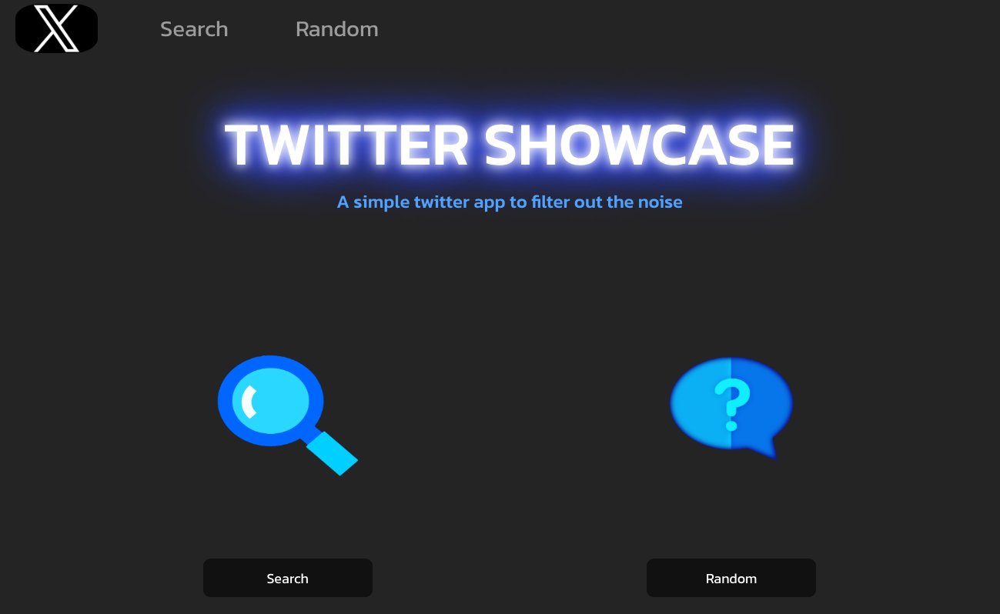

# Twitter Showcase App

 

A more simplified and compressed mini version of twitter using React.js, Axios, Python, CSS, and Bootstrap

 

Try it [here](https://twitter-showcase-2prb.onrender.com)

 

## Summary

This app was designed to level up my experience and knowledge of building full stack applications with a little more depth to how data is requested, filtered, and rendered. It was amazing to connect with Twitters API and learn a lot about how an extremely large data base of tweets can be customized for business as well as managing data. React, Python, Axios, CSS, and Boostrap were the driving technologies for this app. A lot of time was spent in deployment which also gave me a lot more experience with version control, testing locally, and observing deployment logs. This was a fantastic app to build and really hammered home some very important fundatmentals when working with APIs.

## Installation Guide
### Client
1. run `cd Client`
2. run `npm install`
3. run `npm run build`

### Server
1. Open a separate terminal
2. run `cd server`
3. run `py -m venv. venv`
4. run `.venv\Scripts\Activate.ps1`
5. run `pip install -r requirements.txt`
6. create .env file and include __TOKEN__-XXX
7. run `flask --app server --debug run`

## Author

- Gary Hughes Jr - _Full-Stack Software Developer_ - [Website](https://garyhughesjr.netlify.app/) | [LinkedIn](https://www.linkedin.com/in/gary-hughes-jr-64925b229/)

